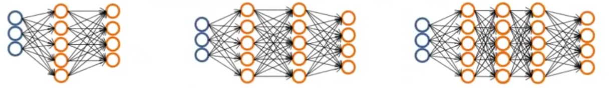

================
 Course content
================

Begining
========

Machine learning definition
---------------------------

* Arthur Samuel (1959): Machine Learning: Field of study that gives computers
  the ability to learn without being explicitly programmed.
* Tom Mitchell (1998): Well-posed Learning Problem: A computer program is said
  to learn from experience E with respect to some task T and some performance
  measure P, if its performance on T, as measured by P, improves with
  experience E.

Machine learning algorithms
---------------------------

* To be seen on this course:

  * Supervised learning
  * Unsupervised learning

* Others:

  * Reinforcement learning
  * Recommender systems

Also talk about: Practical advice for applying learning algorithms.

Supervised learning
-------------------

It assumes that the values given to learn are the right answers to the given
question.

Regression problems
```````````````````
It tries to predict continuous valued output. Example: predict a house sell
price.
      
Classification problems
```````````````````````

It tries to assign a discrete value (classification) for a given output.
Example:

.. math::
   Cancer \rightarrow {benign=0, malign=1}

Linear regression with one variable
===================================

Model representation
--------------------

Notation:

**m** = Number of training examples

**x** = Input variables / features

**y** = Output variables / target variable

Example: Training set of housing prices

+--------------------------------------------------------------------+
| Size in :math:`feet^2` (:math:`x`) | Price in \$1000's (:math:`y`) |
+====================================+===============================+
| 2104                               | 460                           |
+------------------------------------+-------------------------------+
| 1416                               | 232                           |
+------------------------------------+-------------------------------+
| 1534                               | 315                           |
+------------------------------------+-------------------------------+
| 852                                | 178                           |
+------------------------------------+-------------------------------+

Linear algebra review
=====================

Matrices and vectors
--------------------

Matrix
``````

**Definition**
  Rectangular array of numbers.

.. math::
   A = \begin{bmatrix}
         1 & 2 & 3 \\
         4 & 5 & 6 \\
       \end{bmatrix}

**Dimension of matrix**
  Number of rows :math:`\times` number of columns.
        
This example has **2 rows** and **3 columns** and it contains Real numbers, so
it can be represented as :math:`\mathbb{R}^{2\times3}`.

Matrix elements
'''''''''''''''

:math:`A_{ij} = i,j \ entry`; in the :math:`i` row, :math:`j` column. Examples:

.. math::

   A_{11} = 1

   A_{23} = 6

Vector
``````

Definition
  An :math:`n \times 1` matrix.

.. math::
   y = \begin{bmatrix}
         460 \\
         232 \\
         315 \\
         178 \\
       \end{bmatrix}

A 4-dimensional vector; :math:`\mathbb{R}^4`

Vector elements
'''''''''''''''

.. math::
   y_{i} = i element

Example:

.. math::
   y_{1} = 460

   y_{3} = 315


Conventions for the course
--------------------------
          
Naming
  Uppercase letters for matrix naming and lowercase letter for vectors.
1-indexed vs 0-indexed
  The course will use \textbf{1-indexed} vectors unless other condition is
  indicated.

Addition and scalar multiplication
----------------------------------

Matrix addition
```````````````

.. math::
   \begin{bmatrix}
     1 && 0 \\
     2 && 5 \\
     3 && 1 \\
   \end{bmatrix} + \begin{bmatrix}
                     4 && 0.5 \\
                     2 && 5 \\
                     0 && 1 \\
                   \end{bmatrix} = \begin{bmatrix}
                                     5 && 0.5 \\
                                     4 && 10 \\
                                     2 && 3 \\
                                   \end{bmatrix}

Both matrix participating on addition matchs on dimension and the result is
another matrix with the same dimention.

.. math::
   \mathbb{R}^{3\times2} + \mathbb{R}^{3\times2} = \mathbb{R}^{3\times2}

Addition between matrix of different dimension cannot be done:

.. math::
   \mathbb{R}^{3\times2} + \mathbb{R}^{2\times2} = Error

Scalar multiplication
`````````````````````

Scalar = Real number.

.. math::
   3 \times \begin{bmatrix}
              1 && 0 \\
              2 && 5 \\
              3 && 1 \\
            \end{bmatrix} = \begin{bmatrix}
                              3 && 0 \\
                              6 && 15 \\
                              9 && 3 \\
                            \end{bmatrix}

   \begin{bmatrix}
     4 && 0 \\
     6 && 3 \\
   \end{bmatrix} \div 4 = \begin{bmatrix}
                            1 && 0 \\
                            3/2 && 3/4 \\
                          \end{bmatrix}

   \mathbb{R} \times \mathbb{R}^{n \times m} = \mathbb{R}^{n \times m}

Matrix-vector multiplication
````````````````````````````

.. math::
   \begin{bmatrix}
     1 && 3 \\
     4 && 0 \\
     2 && 1 \\
   \end{bmatrix}
   \begin{bmatrix}
     1 \\
     5 \\
   \end{bmatrix} =  \begin{bmatrix}
                      16 \\
                      4 \\
                      7 \\
                    \end{bmatrix} = r

   r_{11} = 1 \times 1 + 3 \times 5 = 16
   
   r_{21} = 4 \times 1 + 0 \times 5 = 4

   r_{31} = 2 \times 1 + 1 \times 5 = 7

The multiplication of matrix with different dimensions produces another matrix
with a mix of them:

.. math::
   \mathbb{R}^{\textbf{3} \times 2} \times \mathbb{R}^{2 \times \textbf{1}} =
   \mathbb{R}^{\textbf{3} \times \textbf{1}}

Generalizing:

.. math::
   \mathbb{R}^{\textbf{a} \times b} \times \mathbb{R}^{c \times \textbf{d}} =
   \mathbb{R}^{\textbf{a} \times \textbf{d}}

   Matrix \times vector = vector

Performing a function as a matrix multiplication
````````````````````````````````````````````````

Function:

.. math::
   h_{\theta}(x) = -40 + 0.25x

Function domain:

.. math::
   D_{h_{\theta}} = {2104, 1416, 1534, 852}

As a matrix multiplication:

.. math::
   \begin{bmatrix}
     1 & 2104 \\
     1 & 1416 \\
     1 & 1534
     1 & 852 \\
   \end{bmatrix} \times \begin{bmatrix}
                          -40 \\
                          0.25 \\
                        \end{bmatrix} = \begin{bmatrix}
                                          -40 \times 1 + 0.25 \times 2104 \\
                                          -40 \times 1 + 0.25 \times 1416 \\
                                          -40 \times 1 + 0.25 \times 1534 \\
                                          -40 \times 1 + 0.25 \times 852 \\
                                        \end{bmatrix}

This is computationally more efficient to resolve this kind of problems this
way:

.. line-block::
   prediction = DataMatrix * parameters

than this way:

.. line-block::
   for i:=1, 1000, ...,
       prediction = ...

Matrix-matrix multiplication
````````````````````````````

.. math::
   \begin{bmatrix}
     1 & 3 & 2 \\
     4 & 0 & 1 \\
   \end{bmatrix}
   \begin{bmatrix}
     1 & 3 \\
     0 & 1 \\
     5 & 2 \\
   \end{bmatrix} = \begin{bmatrix}
                     11 & 10 \\
                     9 & 14 \\
                   \end{bmatrix}

   \mathbb{R}^{2 \times 3} \times \mathbb{R}^{3 \times 2} =
   \mathbb{R}^{2 \times 2}

   \begin{bmatrix}
     1 & 3 & 2 \\
     4 & 0 & 1 \\
   \end{bmatrix}
   \begin{bmatrix}
     1 \\
     0 \\
     5 \\
   \end{bmatrix} = \begin{bmatrix}
                     11 \\
                     9 \\
                   \end{bmatrix}

   \begin{bmatrix}
     1 & 3 & 2 \\
     4 & 0 & 1 \\
   \end{bmatrix}
   \begin{bmatrix}
     3 \\
     1 \\
     2 \\
   \end{bmatrix} = \begin{bmatrix}
                     10 \\
                     14 \\
                   \end{bmatrix}

   A \times B = C

* :math:`A` is a :math:`m \times n` matrix.
* :math:`B` is a :math:`n \times o` matrix.
* :math:`C` is a :math:`m \times o` matrix.

To be able to multiply, the number :math:`n` or rows on :math:`B` matrix must
match the number of columns :math:`n` on :math:`A` matrix.

.. math::
   C_{i} = A \times B_{i}

Performing multiple functions as a matrix multiplication
````````````````````````````````````````````````````````

Functions
  * :math:`h_{\theta}(x) = -40 + 0.25x`
  * :math:`h_{\theta}(x) = 200 + 0.1x`
  * :math:`h_{\theta}(x) = -150 + 0.4x`

Function domain:
  :math:`D_{h_{\theta}} = {2104, 1416, 1534, 852}`

As a matrix multiplication:
  .. math::
     \begin{bmatrix}
       1 & 2104 \\
       1 & 1416 \\
       1 & 1534
       1 & 852 \\
     \end{bmatrix} \times \begin{bmatrix}
                            -40 & 200 & -150 \\
                            0.25 & 0.1 & 0.4 \\
                          \end{bmatrix} = \begin{bmatrix}
                                            486 & 410 & 692 \\
                                            314 & 342 & 416 \\
                                            344 & 353 & 464 \\
                                            173 & 285 & 191 \\
                                          \end{bmatrix}

Matrix multiplication properties
````````````````````````````````

* **Not conmutative:** :math:`A, B`; matrices. In general, :math:`A \times B
  \neq B \times A`.
* **Associative:** :math:`A \times (B \times C) = (A \times B) \times C`
* **Identity matrix:** Denoted by :math:`I` or :math:`I_{n \times n}`. It has
  :math:`1` in the diagonal and :math:`0` on any other position. Example of a
  :math:`I_{3 \times 3}`:

.. math::
   \begin{bmatrix}
     1 & 0 & 1 \\
     0 & 1 & 0 \\
     0 & 0 & 1 \\
   \end{bmatrix}

For any matrix A: :math:`A \times I = I \times A = A`

Inverse and transpose
---------------------

Inverse
```````

.. math::
   1 = Identity

Given a number, multiply it to another one to obtain the identity:

.. math::
   3 \times (3^{-1}) = 3 \times \frac{1}{3} = 1

Not all numbers have an inverse: :math:`0^{0} = undefined`

Matrix inverse
``````````````

If A is a :math:`m \times m` matrix (square matrix), and if it has an inverse:

.. math::
   A(A^{-1}) = A^{-1}A = I

* Only square matrix can have an inverse.
* Matrices that don't have an inverse are some kind too close to zero.
* Matrices that don't have an inverse are "singular" or "degenerate".

Matrix transpose
````````````````

.. math::
   A = \begin{bmatrix}
         1 & 2 & 0 \\
         3 & 5 & 9 \\
       \end{bmatrix} \Rightarrow A^{T} = \begin{bmatrix}
                                           1 & 3 \\
                                           2 & 5 \\
                                           0 & 9 \\
                                         \end{bmatrix}

Let :math:`A` be an :math:`m \times n` matrix, and let :math:`B = A^{T}`. Then
:math:`B` is an :math:`n \times m` matrix and :math:`B_{ij} = A_{ji}`.

Example:

.. math::
   B_{12} = A_{21} = 2

Linear regression with multiple variables
=========================================

Multiple features
-----------------

==================================== ==================== ================== ===================== ===============================
 Size in :math:`feet^2` (:math:`x`)   Number of bedrooms   Number of floors   Age of home (years)   Price in \$1000's (:math:`y`)
==================================== ==================== ================== ===================== ===============================
 2104                                 5                    1                  45                    460
 1416                                 3                    2                  40                    232
 1534                                 3                    2                  30                    315
 852                                  2                    1                  36                    178
 ...                                  ...                  ...                ...                   ...
==================================== ==================== ================== ===================== ===============================

Notation
  * :math:`n` = number of features
  * :math:`x^{(i)}` = input (features) of :math:`i^{th}` training example.
  * :math:`x^{(i)}_{j}` = value of feature :math:`j` in :math:`i^{th}` training
    example.

.. math::
      n = 4

      m = 47

      x^{(2)} = \begin{bmatrix}
                  1416 \\
                  3 \\
                  2 \\
                  40 \\
                \end{bmatrix}

      x^{(2)}_3 = 2

Hypothesis
``````````

.. math::
   h_{\theta}(x) = \theta_{0} + \theta_{1}x_{1} + \theta_{2}x_{2} + \ldots +
   \theta_{n}x_{n}

For convenience of notation, define :math:`x_{0} = 1`.

.. math::
   x = \begin{bmatrix}
         x_{0} \\
         x_{1} \\
         x_{2} \\
         \vdots \\
         x_{n} \\
       \end{bmatrix} \in \mathbb{R}^{n+1} \ \ \ \ \ 
       \theta = \begin{bmatrix}
                  \theta_{0} \\
                  \theta_{1} \\
                  \theta_{2} \\
                  \vdots \\
                  \theta_{n} \\
                \end{bmatrix} \in \mathbb{R}^{n+1}

   h_{\theta}(x) = \theta_{0}x_{0} + \theta_{1}x_{1} + \ldots +
   \theta_{n}x_{n} = \theta^{T}x =
   \begin{bmatrix}
     \theta_{0} & \theta_{1} & \theta_{2} & \vdots & \theta_{n}
   \end{bmatrix}
   \begin{bmatrix}
     x_{0} \\
     x_{1} \\
     x_{2} \\
     \vdots \\
     x_{n} \\
   \end{bmatrix}

Also named **Multivariate linear regression**.

Gradient descent for multiple variables
---------------------------------------

* **Hypothesis:** :math:`h_{\theta}(x) = \theta^{T}x = \theta_{0}x_{0} + \theta_{1}x_{1} + \ldots + \theta_{n}x_{n}`
* **Parameters:** :math:`\theta_{0}, \theta_{1}, \ldots, \theta_{n}`
* **Cost function:** :math:`J(\theta_{0}, \theta_{1}, \ldots, \theta_{n}) = J(\theta) = \frac{1}{2m}\sum\limits_{i=1}^{m}(h_{\theta}(x^{(i)}) - y^{(i)})^{2}`
* **Gradient descent:**

.. math::  
   Repeat \{

   \ \ \theta_{j} := \theta_{j} -
                     \alpha\frac{\partial}{\partial\theta_{j}}
                     J(\theta_{0}, \ldots, \theta_{n}) =
                     \theta_{j} - \alpha\frac{\partial}{\partial\theta_{j}}
                     J(\theta) =
                     \theta_{j} - \alpha\frac{1}{m}
                     \sum\limits_{i=1}^{m}(h_{\theta}(x^{(i)})) - y^{(i)})x^{(i)}_{j}

   \} \ \ (simultaneously update for every j = 0, \ldots, n)

Developing the derivate for :math:`n \geq 1`:

.. math::
   Repeat \{
   \ \ \theta_{j} := \theta_{j} - \alpha\frac{1}{m}
                     \sum\limits_{i=1}^{m}(h_{\theta}(x^{(i)}) - y^{i}x^{(i)}_{j}

   \} \ \ \ (simultaneously update \theta_{j} for j = 0, \ldots, n)

Gradient descent in practice I: Feature scaling
-----------------------------------------------

Make sure features are on similar scale
```````````````````````````````````````

Example:

.. math::
   x_{1} = size (0-2000 feet^{2})

   x_{2} = number of bedrooms (1-5)

The elipses can be very skiny and gradient descent can take a lot of time to
reach the local minimum.

.. math::
   x_{1} = \frac{size (feet^{2})}{2000} \implies 0 \leq x_{1} \leq 1

   x_{2} = \frac{number of bedrooms}{5} \implies 0 \leq x_{2} \leq 1

The elipses are now less tall and the convergence can be reached much faster.

Get every feature approximately a :math:`-1 \leq x_{i} \leq 1`
``````````````````````````````````````````````````````````````

.. math::
   0 \leq x_{1} \leq 3 \checkmark

   -2 \leq x_{1} \leq 0.5 \checkmark

   -100 \leq x_{1} \leq 100 \text{\sffamily X}

Mean normalization
``````````````````

Replace :math:`x_{i}` with :math:`x_{i} - \mu_{i}` to make features have
approximately zero mean (do not apply to :math:`x_{0} = 1`).

Example:

.. math::
   x_{1} = \frac{size - 1000}{2000} \ \ Average: size = 100
   
   x_{2} = \frac{\#bedrooms - 2}{5} \ \ 1 - 5 bedrooms
   
   -0.5 \leq x_{1} \leq 0.5, -0.5 \leq x_{2} \leq 0.5

Generally:

.. math::
   x_{i} = \frac{x_{i} - \mu{i}}{s_{i}}
   
   \mu_{i} = average value of x_{i} in training set.
   
   s_{i} = range of values (max - min, or standard deviation).

Gradient descent in practice II: learning rate
----------------------------------------------

Making sure gradient descent is working correctly
`````````````````````````````````````````````````

Example automatic convergence test:

Declare convergence if :math:`J(\theta)` decrases by less than :math:`10^{-3}`
in one iteration.

If plot graphic is increasing, then the algorithm is not working. **Use a
smaller :math:`\alpha`**.

Facts
'''''

* For sufficiently small :math:`\alpha`, :math:`J(\theta)` should decrease on
  every iteration.
* But if :math:`\alpha` is too small, gradient descent can be slow to converge.

Recomendation
'''''''''''''

To choose :math:`\alpha`, try: :math:`\ldots, 0.001, 0.01, 0.1, 1, \ldots`
Factors of it

To make sure that a value is too short or a value is too large.

Features and polynomial regression
----------------------------------

Changing to new features
````````````````````````

.. math::
   h_{\theta}(x) = \theta_{0} + \theta_{1} \times frontage + \theta_{2} \times
   depth

   frontage = x_{1}, depth = x_{2} \implies area = frontage \times depth

   h_{\theta}(x) = \theta_{0} + \theta_{1}area

Polynomial regression
`````````````````````

.. math::
   Price = y
   Size = x

Using :math:`\theta_{0} + \theta_{1}x + \theta_{2}x^{2}` may match the initial
value but the cuadratic function tends to back to zero, so it is not the
behavior expected for increasing values.

Changing the model to a cubic function:

.. math::
   h_{\theta}(x) = \theta_{0} + \theta_{1}x + \theta_{2}x^{2} + \theta_{3}x_{3}
                 = \theta_{0} + \theta_{1}(size) + \theta_{2}(size)^{2} +
                   \theta_{3}(size)^{3}

Scaling features is important because values can be increase quickly.

Other solution can be:

.. math::
   h_{\theta}(x) = \theta_{0} + \theta_{1}(size) + \theta_{2}\sqrt{size}

Normal equation
---------------

It is a method to solve for :math:`\theta` analytically.

Intuition
`````````

If 1D (:math:`\theta \in \mathbb{R}`)
'''''''''''''''''''''''''''''''''''''

.. math::
   J(\theta) = a\theta^{2} + b\theta + c

Obtaining the minimum: solve for
:math:`\frac{\partial}{\partial\theta}J(\theta) = \ldots = 0`

If nD (:math:`\theta \in \mathbb{R}^{n+1}`)
'''''''''''''''''''''''''''''''''''''''''''

.. math::
   J(\theta_{0}, \theta_{1}, \ldots, \theta_{m}) =
   \frac{1}{2m}\sum\limits_{i=1}^{m}(h_{\theta}(x^{(i)})-y^{(i)})^{2}

Obtaining the minimum: solve for
:math:`\frac{\partial}{\partial\theta}J(\theta) = \ldots = 0` (for every
:math:`j`)

Solve for :math:`\theta_{0}, \theta_{1}, \ldots, \theta_{n}`

Example
'''''''

:math:`m = 4`

+---------------+-------------------------+--------------------+------------------+---------------------+----------------+
|               | Size (:math:`feet^{2}`) | Number of bedrooms | Number of floors | Age of home (years) | Price (\$1000) |
+---------------+-------------------------+--------------------+------------------+-------------------+------------------+
| :math:`x_{0}` | :math:`x_{1}`           | :math:`x_{2}`      | :math:`x_{3}`    | :math:`x_{4}`     | :math:`y`        |
+===============+=========================+====================+==================+===================+==================+
| 1             | 2104                    | 5                  | 1                | 45                | 460              |
+---------------+-------------------------+----------------------+------------------+-------------------+----------------+
| 1             | 1416                    | 3                  | 2                | 40                  | 232            |
+---------------+-------------------------+----------------------+------------------+-------------------+----------------+
|       1       | 1534                    | 3                  | 2                | 30                  | 315            |
+---------------+-------------------------+----------------------+------------------+-------------------+----------------+
|       1       | 852                     | 2                  | 1                | 36                  | 178            |
+---------------+-------------------------+--------------------+------------------+---------------------+----------------+

Using the values from features to create the :math:`X` matrix:

.. math::
   X = \begin{bmatrix}
         1 & 2104 & 5 & 1 & 45 \\
         1 & 1416 & 3 & 2 & 40 \\
         1 & 1534 & 3 & 2 & 30 \\
         1 & 852 & 2 & 1 & 36  \\
       \end{bmatrix} \ \ \ m \times (n+1)

And using the values on last column to create the vector :math:`y`:

.. math::
   X = \begin{bmatrix}
         460 \\
         232 \\
         315 \\
         178 \\
       \end{bmatrix} \ \ \ m-dimensional vector

:math:`\theta = (X^{T}X)^{-1}X^{T}y \ \ \Leftarrow` The value of :math:`\theta`
that minimize the cost function.

When to use Gradient Descent or Normal Ecuation
'''''''''''''''''''''''''''''''''''''''''''''''

For :math:`m` training examples, :math:`n` features:

Gradient Descent
  - Need to choose :math:`\alpha`.
  - Needs many iterations.
  - Works well even when :math:`n` is large.

Normal Ecuation
  - No need to choose :math:`\alpha`.
  - Don't need toiterate.
  - Slow if :math:`n` is very large.

Normal equation and non-invertibility
-------------------------------------

What if :math:`X^{T}T` is non-invertible?
`````````````````````````````````````````

* Redundant features (linearly dependent): e.g.
  :math:`x_{1} = size in feet^{2}; x_{2} = size in m^{2}`
* Too many features (e.g. :math:`m \leq n`): delete some features or use
  regularization.

Logistic Regression
===================

Classification
--------------

.. math::
   y \in {0, 1}

Using plain linear regression applied to a classification problem usually is
not a good idea.

Consecuences
````````````

:math:`h_{\theta}(x)` can be > 1 or < 0.

A Logistic Regression alternative must be used to contain:
        
.. math::
   0 \leq h_{\theta}(x) \leq 1
          
Hypothesis Representation
-------------------------

Logistic Regression Model
`````````````````````````

Want :math:`0 \leq h_{\theta}(x) \leq 1`:

.. math::
   h_{\theta}(x) = g(\theta^{T}x) \wedge g(z) = \frac{1}{1+e^{-z}} \Rightarrow
   g(z) = \frac{1}{1+e^{-\theta^{T}x}}

:math:`g(z)` is the **Sigmoid function** or **Logistic function**.

Interpretation of Hypothesis Output
```````````````````````````````````

:math:`h_{\theta}(x)` = estimated probability that y = 1 on input x

Decision boundary
-----------------

TODO

Cost function
-------------

TODO

Simplified cost function and gradient descent
---------------------------------------------

TODO

Advanced optimization
---------------------

TODO

Multiclass classification: One-vs-all
--------------------------------------

TODO

Regularization
==============

The problem of overfitting
--------------------------

TODO

Cost function
-------------

TODO

Regularized linear regression
-----------------------------

TODO

Regularized logistic regression
-------------------------------

TODO

Neural Networks: representation
===============================

Non-linear hypoteses
--------------------

TODO

Neurons and the brain
---------------------

TODO

Model representation I
----------------------

TODO

Model representation II
-----------------------

TODO

Examples and intuitions I
-------------------------

TODO

Examples and intuitions II
--------------------------

TODO

Multiclass classification
-------------------------

TODO

Neural Networks: learning
=========================

Cost function
-------------

Introduction
````````````
.. math::
   {(x^{(1)},y^{(1)}),(x^{(2)},y^{(2)}),...,(x^{(m)},y^{(m)})} \rightarrow

:math:`m` = total of training examples

:math:`L` = total number of layers in network

:math:`s_{l}` = number of units (not couning bias unit) in layer l


Binary classification
'''''''''''''''''''''

.. math::
   y = 0 \vee 1

1 output unit

.. math::
   h_{\Theta}(x) \in \mathbb{R}

   s_{L} = K = 1

Multi-class classification (K classes)
''''''''''''''''''''''''''''''''''''''

.. math::
   y \in \mathbb{R}^{K}

Example: For pedestrian, car, motorcycle, truck

.. math::
   \begin{bmatrix}
     1 \\
     0 \\
     0 \\
     0 \\
   \end{bmatrix},
   \begin{bmatrix}
     0 \\
     1 \\
     0 \\
     0 \\
   \end{bmatrix},
   \begin{bmatrix}
     0 \\
     0 \\
     1 \\
     0 \\
   \end{bmatrix},
   \begin{bmatrix}
     0 \\
     0 \\
     0 \\
     1 \\
   \end{bmatrix}

K output units

.. math::
   h_{\Theta}(x) \in \mathbb{R}^{K}

   s_{L} = K (usually K \geq 3)

Cost function for logistic regression
`````````````````````````````````````

.. math::
   J(\theta) = -1/m[\sum\limits^{m}_{i=1} y^{(1)}log(h_{\theta}(x^{(i)})) +
                   (1-y^{(i)})log(1-h_{\theta}(x^{(i)}))
               ] + \lambda/2m \sum^{n}_{j=1}(\theta^{2}_{j})

Cost function for neural network
````````````````````````````````

.. math::
   h_{\Theta} \in \mathbb{R}^{K}

:math:`(h_{\Theta}(x))_{i} = i^{th}` output

.. math::
   J(\Theta) = -1/m[\sum\limits^{K}_{k=1} \sum\limits^{m}_{i=1}
                 y_{k}^{(i)}log((h_{\Theta}(x^{(i)}))_{k}) +
                 (1-y_{k}^{(i)})log(1-(h_{\Theta}(x^{(i)}))_{k})
               ] +
               \lambda/2m
               \sum\limits^{L-1}_{l=1}
               \sum\limits^{s_{l}}_{i=1}
               \sum\limits^{s_{l+1}}_{j=1}(\Theta^{(i)}_{ji})^2

Backpropagation algorithm
-------------------------

Gradient computation
````````````````````

.. math::
   \underset{\Theta}{min}J(\Theta)

Need to compute

  - :math:`J(\Theta)`
  - :math:`\frac{\partial}{\partial\Theta_{ij}^{(l)}}J(\Theta)`

Take in count that the parameters in a neural network are
:math:`\Theta^{(i)}_{ij} \in \mathbb{R}`.

Forward propagation
'''''''''''''''''''

Given one training example :math:`(x,y)`, will apply **forward propagation**:

:math:`a^{(1)} = x` a.k.a. activation values
:math:`z^{(2)} = \Theta^{(1)}a^{(1)}`
:math:`a^{(2)} = g(z^{(2)})` (add :math:`a_{0}^{(2)}`)
:math:`z^{(3)} = \Theta^{(2)}a^{(2)}`
:math:`a^{(3)} = g(z^{(3)})` (add :math:`a_{0}^{(3)}`)
:math:`z^{(4)} = \Theta^{(3)}a^{(3)}`
:math:`a^{(4)} = h_{\Theta}(x) = g(z^{(4)})`

Backpropagation algorithm
'''''''''''''''''''''''''

:math:`\delta^{(l)}_{j} =` error of node :math:`j` in layer :math:`l`

For each output unit (layer L = 4)

.. math::
   \delta^{(4)}_{j} = a^{(4)}_{j} - y_{j}
   
Since :math:`a_{j}^{(4)} = (h_{\Theta}(x))_{j}`, the equation above represents
the difference between the hypoteses output and the :math:`y` value on the
training set. It measures how much that node was *responsible* for any errors
in our output.

This also can be represented as vectors:

.. math::
   \delta^{(4)} = a^{(4)} - y

Each element on the equation is a vector whos dimension is equals to the number
of output units on our network.

To compute :math:`\delta^{(4)}` previous deltas must be computed first:

.. math::
   \delta^{(3)} = (\Theta^{(3)})^{T}\delta^{(4)}.*g'(z^{(3)})

   \delta^{(2)} = (\Theta^{(2)})^{T}\delta^{(3)}.*g'(z^{(2)})

   g'(z^{(3)}) = a^{(3)}.*(1-a^{(3)})


There is no :math:`\delta^{(1)}` because the first layer corresponds to the
input layer (input features); there are deltas only for layers greater than 1.

The name *backpropagation* comes from the fact that we stop to compute the
delta values for the output layer and
then we go back to compute the delta values for the previous layers.

:math:`\frac{\partial}{\partial\Theta^{(l)}_{ij}}J(\Theta) =
a^{(l)}_{j}\delta_{i}^{(l+1)}` (ignoring :math:`\lambda`; if
:math:`\lambda = 0`)

Putting all together for many training examples
~~~~~~~~~~~~~~~~~~~~~~~~~~~~~~~~~~~~~~~~~~~~~~~

Traninig set: :math:`{(x^{(1)},y^{(1)}),\ldots,(x^{(m)},y^{(m)})}`

Set :math:`\Delta^{(l)}_{ij} = 0` (for all :math:`l,i,j`) (used to compute
:math:`\frac{\partial}{\partial\Theta^{(l)}_{ij}}J(\Theta)`; this is an
accumulator).

Pseudo-implementation:

+ For :math:`i = 1` to :math:`m`  (each iteration of :math:`(x^{(i)},y^{(i)})`)

    + Set :math:`a^{(l)} = x^{(i)}`
    + Perform forward propagation to compute :math:`a^{(l)}` for
      :math:`l = 2,3,\ldots,L`
    + Using :math:`y^{(i)}`, compute :math:`\delta^{(L)} = a^{(L)} - y^{(i)}`
    + Compute :math:`\delta^{(L-1)},\delta^{(L-2)},\ldots,\delta^{(2)}`
    + :math:`\Delta^{(l)}_{ij} :=
      \Delta^{(l)}_{ij} + a^{(l)}_{j}\delta^{(l+1)}_{i}`; as vectorized
      implementation: :math:`\Delta^{(l)} := 
      \Delta^{(l)} + \delta^{(l+1)}(a^{(l)})^{T}`

:math:`D^{(l)}_{ij} := 1/m\Delta^{(l)}_{ij} + \lambda\Theta^{(l)}_{ij}`
if :math:`j \neq 0`

:math:`D^{(l)}_{ij} := 1/m\Delta^{(l)}_{ij}` if :math:`j = 0`. This case
corresponds to the bias case.

Those D terms are exactly the partial derivative of cost function:

.. math::
   \frac{\partial}{\partial\Theta^{(l)}_{ij}}J(\Theta) = D^{(l)}_{ij}

Backpropagation intuition
-------------------------

In forward propagation the computation flows from the left to the right of the
network. In backpropagation, the computation flows from right to the left of
the network.

Implementation note-unrolling parameters
----------------------------------------

Advanced optimization
`````````````````````

Example: Input layer with 10 units, hidden layer with 10 units, output layer
with 1 unit: :math:`s_{1} = 10, s_{2} = 10, s_{3} = 1`

.. math::
   \Theta^{(1)} \in \mathbb{R}^{10 \times 11}, 
   \Theta^{(2)} \in \mathbb{R}^{10 \times 11}, 
   \Theta^{(3)} \in \mathbb{R}^{1 \times 11}

   \Delta^{(1)} \in \mathbb{R}^{10 \times 11}, 
   \Delta^{(2)} \in \mathbb{R}^{10 \times 11}, 
   \Delta^{(3)} \in \mathbb{R}^{1 \times 11}

Convert this matrixes into vectors in Octave:   

.. code-block:: octave
   :linenos:

   thetaVec = [ Theta1(:); Theta2(:); Theta3(:) ];
   DVec = [D1(:) ; D2(:) ; D3(:)];

   % To revert the conversion:
   Theta1 = reshape(thetaVec(1:110),10,11);
   Theta2 = reshape(thetaVec(111:220),10,11);
   Theta3 = reshape(thetaVec(221:231),1,11);

Use the unrolling idea to implement a learning algorithm
````````````````````````````````````````````````````````

Have initial parameters :math:`\Theta^{(1)}, \Theta^{(2)}, \Theta^{(3)}`.

Unroll to get ``initialTheta`` to pass to
``fminunc(@costFunction, initialTheta, options)``.

What is needed to do is to implement the cost function:

+ ``function [jval, gradientVec] = costFunction(thetaVec)``

  + From ``thetaVec``, get :math:`\Theta^{(1)}, \Theta^{(2)}, \Theta^{(3)}`
    using ``reshape``.
  + Use forward prop/back prop to compute :math:`D^{(1)}, D^{(2)}, D^{(3)}` and
    :math:`J(\Theta)`.
  + Unroll :math:`D^{(1)}, D^{(2)}, D^{(3)}` to get ``gradientVec``.

Gradient checking
-----------------

It helps to make confidence about the forward prop/back prop implementation is
100 % correct and eliminates all the problems associated to a buggy
implementation.

Numerical estimations of gradients
``````````````````````````````````

For single parameter
''''''''''''''''''''

Given a point :math:`\theta \in \mathbb{R}` in cost function :math:`J(\Theta)`
and a distance :math:`\epsilon`:

.. math::
   \frac{\partial}{\partial\theta}J(\theta) \approx
   \frac{J(\theta+\epsilon) - J(\theta-\epsilon)}{2\epsilon}

It gives a good numerical estimate of the gradient at that point.

A good value to use: :math:`\epsilon = 10^{-4}`

Octave implementation
~~~~~~~~~~~~~~~~~~~~~

.. code-block:: octave
   :linenos:

   gradApprox = (J(theta + EPSILON) - J(theta - EPSILON))/(2*EPSILON)

For vectorized parameters
'''''''''''''''''''''''''

Considering a more general case, :math:`\theta \in \mathbb{R}^{n}`: E.g.
:math:`\theta` is *unrolled* version of :math:`Theta^{(1)},Theta^{(2)},Theta^{(3)}`

.. math::
   \theta = \theta_{1}, \theta_{2}, \theta_{3},\ldots,\theta_{n}

   \frac{\partial}{\partial\theta_{1}}J(\theta) \approx
   \frac{J(\theta_{1}+\epsilon,\theta_{2},\theta_{3},\ldots,\theta_{n}) -
         J(\theta_{1}-\epsilon,\theta_{2},\theta_{3},\ldots,\theta_{n})}
   {2\epsilon}

   \frac{\partial}{\partial\theta_{2}}J(\theta) \approx
   \frac{J(\theta_{1},\theta_{2}+\epsilon,\theta_{3},\ldots,\theta_{n}) -
         J(\theta_{1},\theta_{2}-\epsilon,\theta_{3},\ldots,\theta_{n})}
   {2\epsilon}

   \frac{\partial}{\partial\theta_{n}}J(\theta) \approx
   \frac{J(\theta_{1},\theta_{2},\theta_{3},\ldots,\theta_{n}+\epsilon) -
         J(\theta_{1},\theta_{2},\theta_{3},\ldots,\theta_{n}-\epsilon)}
   {2\epsilon}

Implementation in Octave
~~~~~~~~~~~~~~~~~~~~~~~~

.. code-block:: octave
   :linenos:

   for i = 1:n,
       thetaPlus = theta;
       thetaPlus(i) = thetaPlus(i) + EPSILON;
       thetaMinus = theta;
       thetaMinus(i) = thetaMinus(i) - EPSILON;
       gradApprox(i) = (J(thetaPlus) - J(thetaMinus))/(2*EPSILON);
   end;

Check that ``gradApprox`` :math:`\approx` ``DVec`` from back prop.

Implementation note
```````````````````

- Implement backprop to compute ``DVec`` (unrolled :math:`D^{(1)}, D^{(2)}, D^{(3)}`).
- Implement numerical gradient check to compute ``gradApprox``.
- Make sure they give similar values.
- Turn off gradient checking. Using backprop code for learning (no longer compute ``gradApprox``).
  
Important
`````````
- Be sure to disable your gradient checking code before training your
  classifier. If you run numerical gradient computation on every iteration of
  gradient descent (or in the inner loop of ``costFunction(...)``) your code
  will be **very** slow.

Random initialization
---------------------

Initial value of :math:`\Theta`
```````````````````````````````
For gradient descent and advanced optimization, need initial value for :math:`\Theta` (``initialTheta``).

.. code-block:: octave
   :linenos:

   optTheta = fminunc(@costFunction, initialTheta, options)

Consider gradient descent: is it ok to set ``initialTheta = zeros(n,1)``? It
works ok when we are using logistic regression but it does not work on neural
networks.

Zero initialization: :math:`\Theta^{(l)}_{ij} = 0` for all :math:`i,j,l`.

:math:`a_{1}^{(2)} = a_{2}^{(2)}`,  also :math:`\delta_{1}^{(2)} = \delta_{2}^{(2)}`

.. math::
   \frac{\partial}{\partial\Theta^{(1)}_{01}}J(\Theta) =
   \frac{\partial}{\partial\Theta^{(1)}_{02}}J(\Theta)

   \Theta^{(1)}_{01} = \Theta^{(1)}_{02}

After each update, parameters corresponding to inputs going into each of two
hidden units are idential.

.. math::
   a^{(2)}_{1} = a^{(2)}_{2}

This means that the neural network really can't compute any interesting
functions. If there is many others hidden units all of them are computing the
exact same feature, so it becomes a highly redundant representation because you
only need 1 unit to produce the same output. This prevents the network to learn
something interesting.

This problem is called **symmetric weights**.

Random initialization: symmetry breaking
````````````````````````````````````````

Initialize each :math:`\Theta^{(l)}_{ij}` to random value in
:math:`[-\epsilon,\epsilon]` (i.e.
:math:`-\epsilon \leq \Theta^{(l)}_{ij} \leq \epsilon`)

Implementation example in Octave:

.. code-block:: octave
   :linenos:

   % random 10 x 11 matrix between 0 and 1
   Theta1 = rand(10,11) * (2*INIT_EPSILON) - INIT_EPSILON;

   Theta2 = rand(1,11) * (2*INIT_EPSILON) - INIT_EPSILON;

One effective strategy for choosing :math:`\epsilon_{init}` is to base it on
the number of units in the network. A good choice of :math:`\epsilon_{init}`
is:

.. math::
   \epsilon_{init} = \frac{\sqrt{6}}{\sqrt{L_{in} + L_{out}}}

where :math:`L_{in} = s_{l}` and :math:`Lout = s_{l+1}` are the number of units
in the layers adjacent to :math:`\Theta^{(l)}`.


Putting it all together
-----------------------

Training a neural network
`````````````````````````


	
	   Examples of neural networks architectures.

Pic a network architecture (connectivity pattern between neurons).

How to choose? Take in count:

* No. of input units: Dimension of features :math:`x^{(i)}`
* No. output units: Number of classes
* No. of hidden layers: 1 hidden layer is reasonable default, or if > 1 hidden
   layer, have same no. of hidden units in every layer (usually the more the
   better).

Once the architecture was selected, perform the following steps:

#. Randomly initialize weights.
#. Implement forward propagation to get :math:`h_{\Theta}(x^{(1)})` for any
   :math:`x^{(i)}`.
#. Implement code to compute cost function :math:`J(\Theta)`.
#. Implement backprop to compute partial derivatives
   :math:`\frac{\partial}{\partial\Theta^{(l)}_{jk}}J(\Theta)`.

   * ``for i = 1:m`` (each training examples
     :math:`(x^{(1)},y^{(1)}),(x^{(2)},y^{(2)}),\ldots,(x^{(m)},y^{(m)})`)
     
     + Perform forward propagation and backpropagation using example
       :math:`(x^{(i)},y^{(i)})`
     + (Get activations :math:`a^{(l)}` and delta terms :math:`\delta^{(l)}`
       for :math:`l = 2,\ldots,L`
     + :math:`\Delta^{(l)} = \Delta^{(l)} + \delta^{(l+1)}(a^{(l)})^{T}`

   * Compute :math:`\frac{\partial}{\partial\Theta^{(l)}_{ik}}J(\Theta)`

#. Use gradient checking to compare
   :math:`\frac{\partial}{\partial\Theta^{(l)}_{ik}}J(\Theta)` computed using
   backpropagation vs. using numerical estimate of gradient of
   :math:`J(\Theta)`.
#. Use gradient descent or advanced optimization method with backpropagation to
   try to minimize :math:`J(\Theta)` as a function of parameters
   :math:`\Theta`.

   **Note**: in neural networks this cost function :math:`\Theta` is non-convex
   function, so gradient descent or other advanced optimization method can in
   theory get stuck in a local optima, but in practice this is not a huge
   problem.
