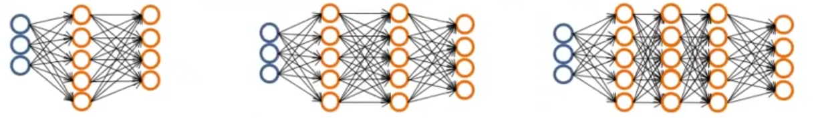

===========================
 Neural Networks: learning
===========================

Cost function
=============

Introduction
------------

.. math::
   {(x^{(1)},y^{(1)}),(x^{(2)},y^{(2)}),...,(x^{(m)},y^{(m)})} \rightarrow

:math:`m` = total of training examples

:math:`L` = total number of layers in network

:math:`s_{l}` = number of units (not couning bias unit) in layer l


Binary classification
`````````````````````

.. math::
   y = 0 \vee 1

1 output unit

.. math::
   h_{\Theta}(x) \in \mathbb{R}

   s_{L} = K = 1

Multi-class classification (K classes)
``````````````````````````````````````

.. math::
   y \in \mathbb{R}^{K}

Example: For pedestrian, car, motorcycle, truck

.. math::
   \begin{bmatrix}
     1 \\
     0 \\
     0 \\
     0 \\
   \end{bmatrix},
   \begin{bmatrix}
     0 \\
     1 \\
     0 \\
     0 \\
   \end{bmatrix},
   \begin{bmatrix}
     0 \\
     0 \\
     1 \\
     0 \\
   \end{bmatrix},
   \begin{bmatrix}
     0 \\
     0 \\
     0 \\
     1 \\
   \end{bmatrix}

K output units

.. math::
   h_{\Theta}(x) \in \mathbb{R}^{K}

   s_{L} = K (usually K \geq 3)

Cost function for logistic regression
-------------------------------------

.. math::
   J(\theta) = -1/m[\sum\limits^{m}_{i=1} y^{(1)}log(h_{\theta}(x^{(i)})) +
                   (1-y^{(i)})log(1-h_{\theta}(x^{(i)}))
               ] + \lambda/2m \sum^{n}_{j=1}(\theta^{2}_{j})

Cost function for neural network
--------------------------------

.. math::
   h_{\Theta} \in \mathbb{R}^{K}

:math:`(h_{\Theta}(x))_{i} = i^{th}` output

.. math::
   J(\Theta) = -1/m[\sum\limits^{K}_{k=1} \sum\limits^{m}_{i=1}
                 y_{k}^{(i)}log((h_{\Theta}(x^{(i)}))_{k}) +
                 (1-y_{k}^{(i)})log(1-(h_{\Theta}(x^{(i)}))_{k})
               ] +
               \lambda/2m
               \sum\limits^{L-1}_{l=1}
               \sum\limits^{s_{l}}_{i=1}
               \sum\limits^{s_{l+1}}_{j=1}(\Theta^{(i)}_{ji})^2

Backpropagation algorithm
=========================

Gradient computation
--------------------

.. math::
   \underset{\Theta}{min}J(\Theta)

Need to compute

  - :math:`J(\Theta)`
  - :math:`\frac{\partial}{\partial\Theta_{ij}^{(l)}}J(\Theta)`

Take in count that the parameters in a neural network are
:math:`\Theta^{(i)}_{ij} \in \mathbb{R}`.

Forward propagation
```````````````````

Given one training example :math:`(x,y)`, will apply **forward propagation**:

:math:`a^{(1)} = x` a.k.a. activation values
:math:`z^{(2)} = \Theta^{(1)}a^{(1)}`
:math:`a^{(2)} = g(z^{(2)})` (add :math:`a_{0}^{(2)}`)
:math:`z^{(3)} = \Theta^{(2)}a^{(2)}`
:math:`a^{(3)} = g(z^{(3)})` (add :math:`a_{0}^{(3)}`)
:math:`z^{(4)} = \Theta^{(3)}a^{(3)}`
:math:`a^{(4)} = h_{\Theta}(x) = g(z^{(4)})`

Backpropagation algorithm
`````````````````````````

:math:`\delta^{(l)}_{j} =` error of node :math:`j` in layer :math:`l`

For each output unit (layer L = 4)

.. math::
   \delta^{(4)}_{j} = a^{(4)}_{j} - y_{j}
   
Since :math:`a_{j}^{(4)} = (h_{\Theta}(x))_{j}`, the equation above represents
the difference between the hypoteses output and the :math:`y` value on the
training set. It measures how much that node was *responsible* for any errors
in our output.

This also can be represented as vectors:

.. math::
   \delta^{(4)} = a^{(4)} - y

Each element on the equation is a vector whos dimension is equals to the number
of output units on our network.

To compute :math:`\delta^{(4)}` previous deltas must be computed first:

.. math::
   \delta^{(3)} = (\Theta^{(3)})^{T}\delta^{(4)}.*g'(z^{(3)})

   \delta^{(2)} = (\Theta^{(2)})^{T}\delta^{(3)}.*g'(z^{(2)})

   g'(z^{(3)}) = a^{(3)}.*(1-a^{(3)})


There is no :math:`\delta^{(1)}` because the first layer corresponds to the
input layer (input features); there are deltas only for layers greater than 1.

The name *backpropagation* comes from the fact that we stop to compute the
delta values for the output layer and
then we go back to compute the delta values for the previous layers.

:math:`\frac{\partial}{\partial\Theta^{(l)}_{ij}}J(\Theta) =
a^{(l)}_{j}\delta_{i}^{(l+1)}` (ignoring :math:`\lambda`; if
:math:`\lambda = 0`)

Putting all together for many training examples
'''''''''''''''''''''''''''''''''''''''''''''''

Traninig set: :math:`{(x^{(1)},y^{(1)}),\ldots,(x^{(m)},y^{(m)})}`

Set :math:`\Delta^{(l)}_{ij} = 0` (for all :math:`l,i,j`) (used to compute
:math:`\frac{\partial}{\partial\Theta^{(l)}_{ij}}J(\Theta)`; this is an
accumulator).

Pseudo-implementation:

+ For :math:`i = 1` to :math:`m`  (each iteration of :math:`(x^{(i)},y^{(i)})`)

    + Set :math:`a^{(l)} = x^{(i)}`
    + Perform forward propagation to compute :math:`a^{(l)}` for
      :math:`l = 2,3,\ldots,L`
    + Using :math:`y^{(i)}`, compute :math:`\delta^{(L)} = a^{(L)} - y^{(i)}`
    + Compute :math:`\delta^{(L-1)},\delta^{(L-2)},\ldots,\delta^{(2)}`
    + :math:`\Delta^{(l)}_{ij} :=
      \Delta^{(l)}_{ij} + a^{(l)}_{j}\delta^{(l+1)}_{i}`; as vectorized
      implementation: :math:`\Delta^{(l)} := 
      \Delta^{(l)} + \delta^{(l+1)}(a^{(l)})^{T}`

:math:`D^{(l)}_{ij} := 1/m\Delta^{(l)}_{ij} + \lambda\Theta^{(l)}_{ij}`
if :math:`j \neq 0`

:math:`D^{(l)}_{ij} := 1/m\Delta^{(l)}_{ij}` if :math:`j = 0`. This case
corresponds to the bias case.

Those D terms are exactly the partial derivative of cost function:

.. math::
   \frac{\partial}{\partial\Theta^{(l)}_{ij}}J(\Theta) = D^{(l)}_{ij}

Backpropagation intuition
=========================

In forward propagation the computation flows from the left to the right of the
network. In backpropagation, the computation flows from right to the left of
the network.

Implementation note-unrolling parameters
========================================

Advanced optimization
---------------------

Example: Input layer with 10 units, hidden layer with 10 units, output layer
with 1 unit: :math:`s_{1} = 10, s_{2} = 10, s_{3} = 1`

.. math::
   \Theta^{(1)} \in \mathbb{R}^{10 \times 11}, 
   \Theta^{(2)} \in \mathbb{R}^{10 \times 11}, 
   \Theta^{(3)} \in \mathbb{R}^{1 \times 11}

   \Delta^{(1)} \in \mathbb{R}^{10 \times 11}, 
   \Delta^{(2)} \in \mathbb{R}^{10 \times 11}, 
   \Delta^{(3)} \in \mathbb{R}^{1 \times 11}

Convert this matrixes into vectors in Octave:   

.. code-block:: octave

   :linenos:

   thetaVec = [ Theta1(:); Theta2(:); Theta3(:) ];
   DVec = [D1(:) ; D2(:) ; D3(:)];

   % To revert the conversion:
   Theta1 = reshape(thetaVec(1:110),10,11);
   Theta2 = reshape(thetaVec(111:220),10,11);
   Theta3 = reshape(thetaVec(221:231),1,11);

Use the unrolling idea to implement a learning algorithm
--------------------------------------------------------

Have initial parameters :math:`\Theta^{(1)}, \Theta^{(2)}, \Theta^{(3)}`.

Unroll to get ``initialTheta`` to pass to
``fminunc(@costFunction, initialTheta, options)``.

What is needed to do is to implement the cost function:

+ ``function [jval, gradientVec] = costFunction(thetaVec)``

  + From ``thetaVec``, get :math:`\Theta^{(1)}, \Theta^{(2)}, \Theta^{(3)}`
    using ``reshape``.
  + Use forward prop/back prop to compute :math:`D^{(1)}, D^{(2)}, D^{(3)}` and
    :math:`J(\Theta)`.
  + Unroll :math:`D^{(1)}, D^{(2)}, D^{(3)}` to get ``gradientVec``.

Gradient checking
=================

It helps to make confidence about the forward prop/back prop implementation is
100 % correct and eliminates all the problems associated to a buggy
implementation.

Numerical estimations of gradients
----------------------------------

For single parameter
````````````````````

Given a point :math:`\theta \in \mathbb{R}` in cost function :math:`J(\Theta)`
and a distance :math:`\epsilon`:

.. math::
   \frac{\partial}{\partial\theta}J(\theta) \approx
   \frac{J(\theta+\epsilon) - J(\theta-\epsilon)}{2\epsilon}

It gives a good numerical estimate of the gradient at that point.

A good value to use: :math:`\epsilon = 10^{-4}`

Octave implementation
'''''''''''''''''''''

.. code-block:: octave

   :linenos:

   gradApprox = (J(theta + EPSILON) - J(theta - EPSILON))/(2*EPSILON)

For vectorized parameters
`````````````````````````

Considering a more general case, :math:`\theta \in \mathbb{R}^{n}`: E.g.
:math:`\theta` is *unrolled* version of :math:`Theta^{(1)},Theta^{(2)},
Theta^{(3)}`

.. math::
   \theta = \theta_{1}, \theta_{2}, \theta_{3},\ldots,\theta_{n}

   \frac{\partial}{\partial\theta_{1}}J(\theta) \approx
   \frac{J(\theta_{1}+\epsilon,\theta_{2},\theta_{3},\ldots,\theta_{n}) -
         J(\theta_{1}-\epsilon,\theta_{2},\theta_{3},\ldots,\theta_{n})}
   {2\epsilon}

   \frac{\partial}{\partial\theta_{2}}J(\theta) \approx
   \frac{J(\theta_{1},\theta_{2}+\epsilon,\theta_{3},\ldots,\theta_{n}) -
         J(\theta_{1},\theta_{2}-\epsilon,\theta_{3},\ldots,\theta_{n})}
   {2\epsilon}

   \frac{\partial}{\partial\theta_{n}}J(\theta) \approx
   \frac{J(\theta_{1},\theta_{2},\theta_{3},\ldots,\theta_{n}+\epsilon) -
         J(\theta_{1},\theta_{2},\theta_{3},\ldots,\theta_{n}-\epsilon)}
   {2\epsilon}

Implementation in Octave
''''''''''''''''''''''''

.. code-block:: octave

   :linenos:

   for i = 1:n,
       thetaPlus = theta;
       thetaPlus(i) = thetaPlus(i) + EPSILON;
       thetaMinus = theta;
       thetaMinus(i) = thetaMinus(i) - EPSILON;
       gradApprox(i) = (J(thetaPlus) - J(thetaMinus))/(2*EPSILON);
   end;

Check that ``gradApprox`` :math:`\approx` ``DVec`` from back prop.

Implementation note
-------------------

- Implement backprop to compute ``DVec`` (unrolled :math:`D^{(1)}, D^{(2)},
  D^{(3)}`).
- Implement numerical gradient check to compute ``gradApprox``.
- Make sure they give similar values.
- Turn off gradient checking. Using backprop code for learning (no longer
  compute ``gradApprox``).
  
Important
---------

- Be sure to disable your gradient checking code before training your
  classifier. If you run numerical gradient computation on every iteration of
  gradient descent (or in the inner loop of ``costFunction(...)``) your code
  will be **very** slow.

Random initialization
=====================

Initial value of :math:`\Theta`
-------------------------------
For gradient descent and advanced optimization, need initial value for
:math:`\Theta` (``initialTheta``).

.. code-block:: octave

   :linenos:

   optTheta = fminunc(@costFunction, initialTheta, options)

Consider gradient descent: is it ok to set ``initialTheta = zeros(n,1)``? It
works ok when we are using logistic regression but it does not work on neural
networks.

Zero initialization: :math:`\Theta^{(l)}_{ij} = 0` for all :math:`i,j,l`.

:math:`a_{1}^{(2)} = a_{2}^{(2)}`,  also :math:`\delta_{1}^{(2)} = \delta_{2}^{(2)}`

.. math::
   \frac{\partial}{\partial\Theta^{(1)}_{01}}J(\Theta) =
   \frac{\partial}{\partial\Theta^{(1)}_{02}}J(\Theta)

   \Theta^{(1)}_{01} = \Theta^{(1)}_{02}

After each update, parameters corresponding to inputs going into each of two
hidden units are idential.

.. math::
   a^{(2)}_{1} = a^{(2)}_{2}

This means that the neural network really can't compute any interesting
functions. If there is many others hidden units all of them are computing the
exact same feature, so it becomes a highly redundant representation because you
only need 1 unit to produce the same output. This prevents the network to learn
something interesting.

This problem is called **symmetric weights**.

Random initialization: symmetry breaking
----------------------------------------

Initialize each :math:`\Theta^{(l)}_{ij}` to random value in
:math:`[-\epsilon,\epsilon]` (i.e.
:math:`-\epsilon \leq \Theta^{(l)}_{ij} \leq \epsilon`)

Implementation example in Octave:

.. code-block:: octave

   :linenos:

   % random 10 x 11 matrix between 0 and 1
   Theta1 = rand(10,11) * (2*INIT_EPSILON) - INIT_EPSILON;

   Theta2 = rand(1,11) * (2*INIT_EPSILON) - INIT_EPSILON;

One effective strategy for choosing :math:`\epsilon_{init}` is to base it on
the number of units in the network. A good choice of :math:`\epsilon_{init}`
is:

.. math::
   \epsilon_{init} = \frac{\sqrt{6}}{\sqrt{L_{in} + L_{out}}}

where :math:`L_{in} = s_{l}` and :math:`Lout = s_{l+1}` are the number of units
in the layers adjacent to :math:`\Theta^{(l)}`.

Putting it all together
=======================

Training a neural network
-------------------------



	   Examples of neural networks architectures.

Pic a network architecture (connectivity pattern between neurons).

How to choose? Take in count:

* No. of input units: Dimension of features :math:`x^{(i)}`
* No. output units: Number of classes
* No. of hidden layers: 1 hidden layer is reasonable default, or if > 1 hidden
   layer, have same no. of hidden units in every layer (usually the more the
   better).

Once the architecture was selected, perform the following steps:

#. Randomly initialize weights.
#. Implement forward propagation to get :math:`h_{\Theta}(x^{(1)})` for any
   :math:`x^{(i)}`.
#. Implement code to compute cost function :math:`J(\Theta)`.
#. Implement backprop to compute partial derivatives
   :math:`\frac{\partial}{\partial\Theta^{(l)}_{jk}}J(\Theta)`.

   * ``for i = 1:m`` (each training examples
     :math:`(x^{(1)},y^{(1)}),(x^{(2)},y^{(2)}),\ldots,(x^{(m)},y^{(m)})`)
     
     + Perform forward propagation and backpropagation using example
       :math:`(x^{(i)},y^{(i)})`
     + (Get activations :math:`a^{(l)}` and delta terms :math:`\delta^{(l)}`
       for :math:`l = 2,\ldots,L`
     + :math:`\Delta^{(l)} = \Delta^{(l)} + \delta^{(l+1)}(a^{(l)})^{T}`

   * Compute :math:`\frac{\partial}{\partial\Theta^{(l)}_{ik}}J(\Theta)`

#. Use gradient checking to compare
   :math:`\frac{\partial}{\partial\Theta^{(l)}_{ik}}J(\Theta)` computed using
   backpropagation vs. using numerical estimate of gradient of
   :math:`J(\Theta)`.
#. Use gradient descent or advanced optimization method with backpropagation to
   try to minimize :math:`J(\Theta)` as a function of parameters
   :math:`\Theta`.

   **Note**: in neural networks this cost function :math:`\Theta` is non-convex
   function, so gradient descent or other advanced optimization method can in
   theory get stuck in a local optima, but in practice this is not a huge
   problem.
