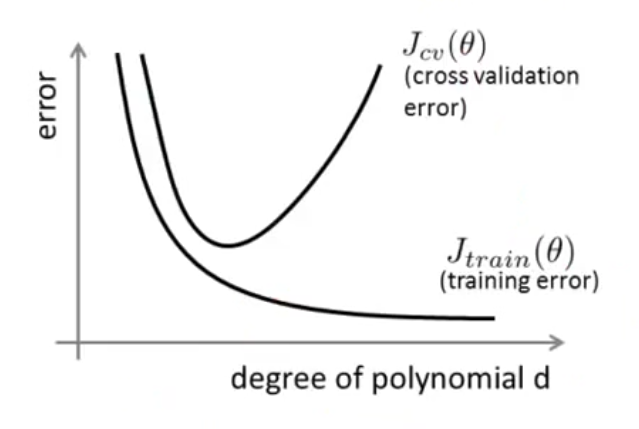
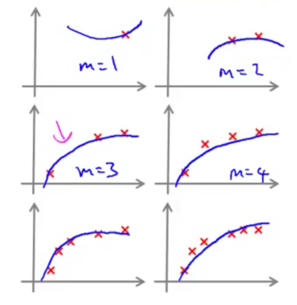
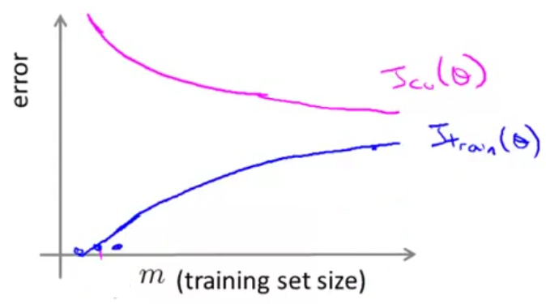
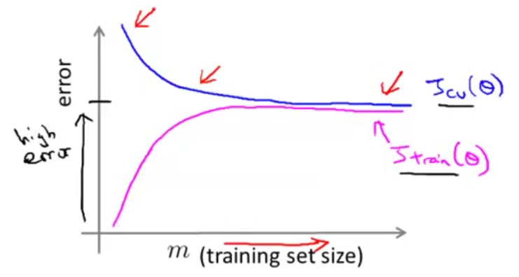
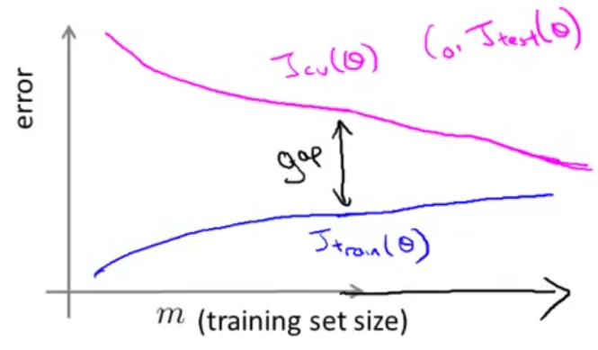
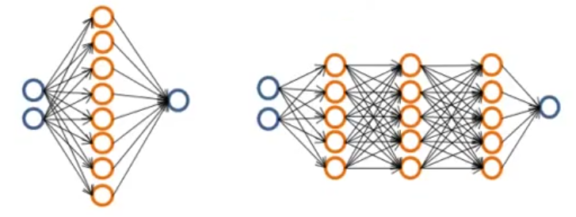

======================================
 Advice for applying Machine Learning
======================================

Deciding what to try next
=========================

Debugging a learning algorithm
------------------------------

Suppose you have implemented regularized linear regression to predict **housing
prices**.

.. math::
   J(\theta) = 1/2m(\sum\limits_{i=1}^{m} (h_{\theta}(x^{(i)}) - y^{(i)})^2 +
               \lambda\sum\limits_{j=1}^{m} \theta^{2}_{j})

However, when you test your hypothesis on a new set of houses, you find that it
makes unacceptably large errors in its predictions. What should you try next?

- Get more training examples, but do not spend too much time collecting a hugh
  quantity of examples because in some cases it does not help.
- Try smaller sets of features to prevent overfitting.
- Try getting additional features.
- Try adding polynomial features (:math:`x^{2}_{1}, x^{2}_{2}, x_{1}x_{2}`,
  etc).
- Try increasin/decreasing :math:`\lambda`.

Machine Learninng diagnostic
----------------------------

Diagnostic: A test that you can run to gain insight what is/isn't working with
a learning algorithm, and gain guidance as to how best to improve its
performance.

Generally, the diagnostic takes time to perform but it worth the effort for
visualizing the correct path to choose.

Evaluating a hypothesis
=======================

When an hypothesis has very low error value it generally fails to generalize to
new examples not in the training set.

In problems with many features is difficult if not impossible to plot the
function behaviour to visualize what is going on.

The standard strategy to evaluate an hypothesis is split the training set into
2 portions: the training set and the test set.

.. code:: text

   ====== =======
    Size   Price
   ====== =======
    2104   400    \
    1600   330     |
    2400   369     | 
    1416   232     | Training set (~70%)
    3000   540     |
    1985   300     |
    1534   315    /
   ------ -------
    1427   199    \           
    1380   212     | Test set (~30%)
    1494   243    /           
   ====== =======

* :math:`m_{test} =` no. of test examples.
* :math:`(x^{(i)_{test}}, y^{(i)}_{test}) =` an specific test example.

**To take in count**: If there is any sort on the data then is better to
collect a random set for training data as for test data. If the data is already
randomly picked, then just take the values as in their locations.

Training/testing procedure for linear regression
------------------------------------------------

- Learn parameter :math:`\theta` from training data (minimizing training error
  :math:`J(\theta)` using only the training data [the ~70%]).
- Compute test set error:

.. math::
   J_{test}(\theta) = 1/2m_{test} \sum\limits_{i=1}^{m_{test}}
   (h_{\theta}(x_{test}^{(i)}) - y_{test}^{(i)})^{2}

Training/testing procedure for logistic regression
--------------------------------------------------

- Learn parameter :math:`\theta` from training data.
- Compute test set error:

.. math::
   J_{test}(\theta) = -1/m_{test}
   \sum\limits_{i=1}^{m_{test}}y_{test}^{(i)}log(h_{\theta}(x_{test}^{(i)})) +
   (1-y_{test}^{(i)})log(h_{\theta}(x_{test}^{(i)}))

- **Alternative that is usually easy to interpret:** Misclassification error
  (a.k.a. 0/1 misclassification error). Defines the error on classificating an
  example error right or wrong.

.. math::
   err(h_{\theta},y) =
     \left\{
       \begin{array}{ll}
         1 & \mbox{if } h_{\theta}(x) \geq 0.5, y = 0 \ \ \
         \mbox{(This is the error)} \\
         0 & \mbox{if } h_{\theta}(x) < 0.5, y = 1
       \end{array}
     \right.

   \mbox{Test error} = 1/m_{test}
   \sum\limits_{i=1}^{m_{test}}err(h_{\theta}(x^{(i)}_{test},y_{test}^{(i)})
    \ \ \ \mbox{This is the fraction of the test set misslabeled.}

Model selection and training/validation/test sets
=================================================

Overfitting example
-------------------

.. math::
   h_{\theta}(x) = \theta_{0} + \theta_{1}x + \theta_{2}x^{2} + \theta_{3}x^{3}
                   + \theta_{4}x^{4}

Once parameters :math:`\theta_{0}, \theta_{1}, \ldots, \theta_{4}` were fit to
some set of data (training set), the error of the parameters as measured on
that data (the training error :math:`J(\theta)` is likely to be lower than the
actual generalization error (how well your hypotesys will generalize on new
examples).

Model selection
---------------

Which model to use?

* :math:`d =` degree of polinomial

#. :math:`h_{\theta}(x) = \theta_{0} + \theta_{1}x \Rightarrow d = 1`
#. :math:`h_{\theta}(x) = \theta_{0} + \theta_{1}x + \theta_{2}x^{2}
   \Rightarrow d = 2`
#. :math:`h_{\theta}(x) = \theta_{0} + \theta_{1}x + \theta_{2}x^{2} +
   \theta_{3}x^{3} \Rightarrow d = 3`
#. ...
#. :math:`h_{\theta}(x) = \theta_{0} + \theta_{1}x + \ldots + \theta_{10}x^{10}
   \Rightarrow d = 10`

How well the selected hypothesis will generalize over future examples?

Minimize the training error to get the parameter vector :math:`\theta^{(i)}`:

#. :math:`h_{\theta}(x) = \theta_{0} + \theta_{1}x \Rightarrow \theta^{(1)}
   \Rightarrow J_{test}(\theta^{(1)})`
#. :math:`h_{\theta}(x) = \theta_{0} + \theta_{1}x + \theta_{2}x^{2}
   \Rightarrow \theta^{(2)}
   \Rightarrow J_{test}(\theta^{(2)})`
#. :math:`h_{\theta}(x) = \theta_{0} + \theta_{1}x + \theta_{2}x^{2} +
   \theta_{3}x^{3} \Rightarrow \theta^{(3)} \Rightarrow J_{test}(\theta^{(3)})`
#. ...
#. :math:`h_{\theta}(x) = \theta_{0} + \theta_{1}x + \ldots
   + \theta_{10}x^{10} \Rightarrow  \theta^{(10)}
   \Rightarrow J_{test}(\theta^{(10)})`

Supposing to choose :math:`\theta_{0} + \ldots + \theta_{5}x^{5}` as the best
fit. How well does the model generalize? Report test set error
:math:`J_{test}(\theta^{(5)})`, but there is a **problem**: it is likely to be
an optimistic estimate of generalization error. In example: our extra parameter
:math:`d` is fit to test set (maybe this degree does well on the test set but
overfits when tries to predict other examples not being seen before).

Evaluating your hypothesis
--------------------------

.. code:: text

   ====== =======
    Size   Price
   ====== =======
    2104   400    \
    1600   330     |
    2400   369     | 
    1416   232     | Training set (~60%)
    3000   540     |
    1985   300    /
   ------ -------
    1534   315    \
    1427   199    / Cross validation set (~20%)
   ------ -------
    1380   212    \
    1494   243    / Test set (~20%)
   ====== =======

* :math:`m_{vc} =` no. of cross validation examplees.
* :math:`(x^{(i)}_{cv},y^{(i)}_{cv}) =` an specific cross validation example.
* :math:`m_{test} =` no. of test examples.
* :math:`(x^{(i)_{test}}, y^{(i)}_{test}) =` an specific test example.

Train/validation/test error
---------------------------

* Training error:

.. math::
   J_{train}(\theta) = 1/2m \sum\limits_{i=1}^{m}
   (h_{\theta}(x^{(i)}) - y^{(i)})^{2}

* Cross validation error:

.. math::
   J_{cv}(\theta) = 1/2m_{cv} \sum\limits_{i=1}^{m_{cv}}
   (h_{\theta}(x_{cv}^{(i)}) - y_{cv}^{(i)})^{2}   

* Test error:

.. math::
   J_{test}(\theta) = 1/2m_{test} \sum\limits_{i=1}^{m_{test}}
   (h_{\theta}(x_{test}^{(i)}) - y_{test}^{(i)})^{2}

Model selection
---------------

Now initialy we are goning to minimize the cost function and use parameter
vector :math:`\theta^{(i)}` in on cross validation set to select the errorless
model to see how well it does on each model:

#. :math:`h_{\theta}(x) = \theta_{0} + \theta_{1}x \Rightarrow
   \underset{\Theta}{min}J(\theta) \Rightarrow \theta^{1} \Rightarrow
   J_{cv}(\theta^{1})`
#. :math:`h_{\theta}(x) = \theta_{0} + \theta_{1}x + \theta_{2}x^{2}
   \Rightarrow \theta^{2} \Rightarrow J_{cv}(\theta^{2})`
#. :math:`h_{\theta}(x) = \theta_{0} + \theta_{1}x + \ldots + \theta_{3}x^{3}
   \Rightarrow \theta^{3} \Rightarrow J_{cv}(\theta^{3})`
#. ...
#. :math:`h_{\theta}(x) = \theta_{0} + \theta_{1}x + \ldots + \theta_{10}x^{10}
   \Rightarrow \theta^{10} \Rightarrow J_{cv}(\theta^{10})`

Suppose :math:`\theta_{0} + \theta_{1}x_{1} + \ldots + \theta_{4}x^{4}` is
picked: now must estimage generalization error for test set:
:math:`J_{test}(\theta^{(4)})` and selects the errorless model reported, which
**no necesary will be the same model as in cross validation**.

In example: :math:`J_{test}(\theta^{(4)}) \Rightarrow \mbox{best model results}
\theta^{(10)}`.

Diagnosing bias vs. variance
============================

Bias/variance
-------------

* High bias (underfit)

.. math::
   \theta_{0} + \theta_{1}x

   d = 1

* "Just right"

.. math::
   \theta_{0} + \theta_{1}x + \theta_{2}x^{2}

   d = 2
   
* High variance (overfit):

.. math::
   \theta_{0} + \theta_{1}x + \theta_{2}x^{2} + \theta_{3}x^{3} +
   \theta_{4}x^{4}

   d = 4

Diagnosing bias vs. variance
----------------------------

Suppose your learning algorithm is performing less well that you were hoping
(:math:`J_{cv}(\theta)` or :math:`J_{test}(\theta)` is high). Is it a bias
problem or a variance problem?

   Bias and variance plotted behaviours

* It will be a **Bias problem** because (left range):
  
  + :math:`J_{train}(\theta)` will be high
  + :math:`J_{cv}(\theta) \approx J_{train}(\theta)`

* It will be a **Variance problem** because (right range):

  + :math:`J_{train}(\theta)` will be low
  + :math:`J_{cv}(\theta) \gg J_{train}(\theta)`

Regularization and bias/variance
================================

Linear regression with regularization
-------------------------------------

Model:

.. math::
   h_{\theta}(x) = \theta_{0} + \theta_{1}x + \theta_{2}x^{2} + \theta_{x}x^{3}
   + \theta_{4}x^{4}

   J(\theta) = 1/2m \sum\limits_{i=1}^{m}(h_{\theta}(x^{(i)}) - y^{(i)})^{2} +
   \lambda/2m \sum\limits_{j=1}^{m} \theta^{2}_{j}

Scenarios:

* Large :math:`\lambda`; high bias (underfit):

.. math::
   \lambda = 10000

   \theta_{1} \approx 0, \theta_{2} \approx 0, \ldots
   h_{\theta}(x) \approx \theta_{0}

* Intermediate :math:`\lambda`; "just right".

* Small :math:`\lambda`; high variance (overfit):

.. math::
   \lambda = 0

How can we choose a good value for the regularization parameter
:math:`\lambda`?

Choosing the regularization parameter :math:`\lambda`
-----------------------------------------------------

.. math::
   h_{\theta}(x) = \theta_{0} + \theta_{1}x + \theta_{2}x^{2} + \theta_{3}x^{3}
   + \theta_{4}x^{4}

   J(\theta) = 1/2m \sum\limits_{i=1}^{m}(h_{\theta}(x^{(i)}) - y^{(i)})^{2} +
   \lambda/2m \sum\limits_{j=1}^{m}\theta^{2}_{j}

   \mbox{\^The square area without the extra regularization term}

   J_{train}(\theta) = 1/2m
   \sum\limits_{i=1}^{m}(h_{\theta}(x^{(i)}) - y^{(i)})^{2}

   J_{cv}(\theta) = 1/2m_{cv}
   \sum\limits_{i=1}^{m_{cv}}(h_{\theta}(x_{cv}^{(i)}) - y_{cv}^{(i)})^{2} 

   J_{test}(\theta) = 1/2m_{test}
   \sum\limits_{i=1}^{m_{test}}(h_{\theta}(x_{test}^{(i)}) -
   y_{test}^{(i)})^{2} 

Trying different values of :math:`\lambda`, the :math:`J_{cv}(\theta^{(i)})`
with lowest error must be selected:

1. Try :math:`\lambda = 0` (not using regularization) :math:`\Rightarrow
   \underset{\theta}{min}J(\theta) \Rightarrow \theta^{(1)} \Rightarrow
   J_{cv}(\theta^{(1)})`
2. Try :math:`\lambda = 0.01 \Rightarrow \theta^{(2)} \Rightarrow
   J_{cv}(\theta^{(2)})`
3. Try :math:`\lambda = 0.02 \Rightarrow \theta^{(3)} \Rightarrow
   J_{cv}(\theta^{(3)})`
4. Try :math:`\lambda = 0.04` ...
5. Try :math:`\lambda = 0.08` ...

...

12. Try :math:`\lambda = 10` (approximated; 10.24 is good too)
    :math:`\Rightarrow \theta^{(12)} \Rightarrow J_{cv}(\theta^{(12)})`

Suppose :math:`\theta^{(5)}` is selected. Test error to verify how well it
does on test set: :math:`J_{test}(\\theta^{(5)})`

Bias/variance as a function of the regularization parameter :math:`\lambda`
---------------------------------------------------------------------------

   Bias and variance as function of :math:`\lambda`

.. math::
   J(\theta) = 1/2m \sum\limits_{i=1}^{m} (h_{\theta}(x^{(i)}) - y^{(i)})^2 +
   \lambda/2m \sum\limits_{j=1}^{m}\theta^{2}_{j}

   J_{train}(\theta) = 1/2m \sum\limits_{i=1}^{m} (h_{\theta}(x^{(i)}) -
   y^{(i)})^2

   J_{cv}(\theta) = 1/2m_{cv} \sum\limits_{i=1}^{m_{cv}}
   (h_{\theta}(x_{cv}^{(i)}) - y_{cv}^{(i)})^2

Learning curves
===============

Plotting learning curves already helps to know if the algorithm suffers from a
bias problem or a variance problem or both.

Plotting curves
---------------

.. math::
   J_{train}(\theta) = 1/2m \sum\limits_{i=1}^{m}(h_{\theta}(x^{(i)}) -
   y^{(i)})^{2}

   J_{cv}(\theta) = 1/2m_{cv}
   \sum\limits_{i=1}^{m_{cv}}(h_{\theta}(x_{cv}^{(i)}) - y_{cv}^{(i)})^{2}

   h_{\theta}(x) = \theta_{0} + \theta_{1}x + \theta_{2}x^{2}

   Learning curve fitting while training examples increases

On :math:`m = 1`, :math:`m = 2` or :math:`m = 3` maybe the curve matchs
perfectly (0 errors) the point for the training example, but while the training
set examples increases the curve no longer fits, so error is also
**increasing**.

For cross validation, while less training examples the error value will be
high so increasing them will perform in less error; the curve will
**decrease**. The more date it has the better for generalizing into new
examples.

   Learning curves for training and cross validation set

High bias
---------

:math:`h_{\theta}(x) = \theta_{0} + \theta_{1}x`

If a learning algorithm is suffering from high bias, getting more traning data
will not (by itself) help much. Both :math:`J_{cv}(\theta)` and
:math:`J_{train}(\theta)` will have high error.

   Learning curves for high bias problem

High variance
-------------

:math:`h_{\theta}(x) = \theta_{0} + \theta_{1}x + \ldots + \theta_{100}x^{100}`
(and small :math:`\lambda`)

If a learning algorithm is suffering from high variance, getting more training
data is likely to help, because if one follows the plot lines will se that they
have a point in common, given by more test examples.

   Learning curves for high variance problem

Deciding what to try next (revisited)
=====================================

Debugging a learning algorithm
------------------------------

Suppose you have implemented regularized linear regression to predict **housing
prices**. However, when you test your hypothesis in a new set of houses, you
find that it makes unacceptably large errors in its prediction. What should you
try next?

- Get more training examples :math:`\Rightarrow` **fixes high variance**
- Get smaller set of features :math:`\Rightarrow` **fixes high variance**  
- Try getting additional features :math:`\Rightarrow` **fixes high bias**
- Try adding polynomial features (:math:`x^{2}_{1}, x^{2}_{2}, x_{1}x_{2}`,
  etc) :math:`\Rightarrow` **fixes high bias**
- Try decreasing :math:`\lambda` :math:`\Rightarrow` **fixes high bias**
- Try increasing :math:`\lambda` :math:`\Rightarrow` **fixes high variance**

Neural networks and overfitting
-------------------------------

*Small* neural network (fewer parameters and/or fewer hidden leayers; more
prone to underfitting). Computationally cheaper.

   A small neural network

*Large* neural network (more parameters and/or large hidden layers; more prone
to overfitting). Computationally more expensive.

Use regularization (:math:`\lambda`) to address overfitting.

   Large neural networks

