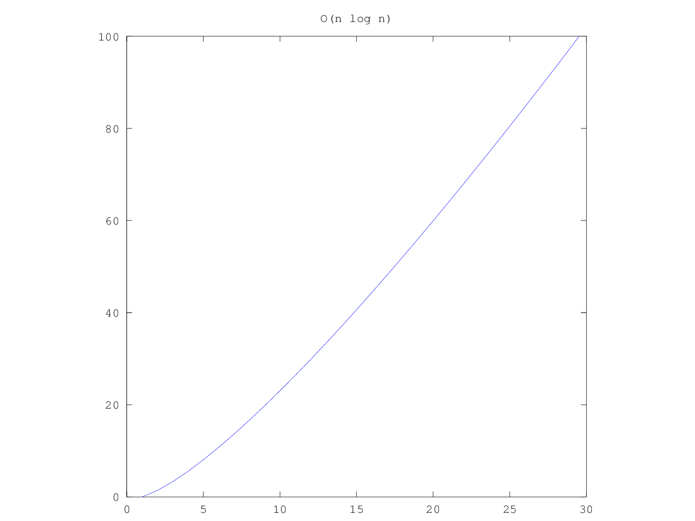
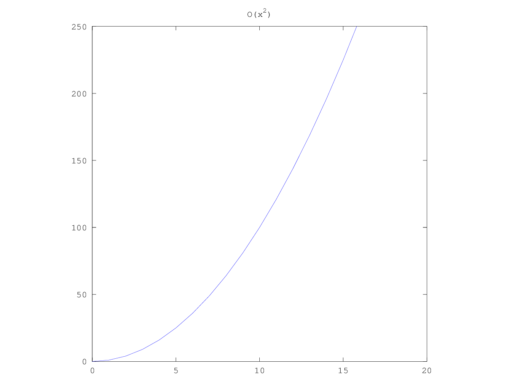

========================================
 Exposición: Algoritmos de ordenamiento
========================================

Algoritmos que se expondrán
    + Quicksort_
    + Heapsort_
    + Mergesort_

Fecha de exposición
    2014-04-30

Introducción
============

- TODO: Qué son.
- TODO: Cuándo se aplica.

Quicksort_
==========

La función de este algoritmo es ordenar una lista de elementos del mismo tipo y
está basado en la técnica "divide y vencerás", de modo que convierte un
problema complicado, en muchos sencillos, pero además es el más rápido conocido
para hacer esta tarea. Está matemáticamente demostrado que no se puede hacer un
algoritmo de ordenación más rápido que Quicksort.

Su autor
--------

.. figure:: _static/img/CAR_Hoare.jpg
   :width: 300 px
   :align: center

   Charles Antony Richard Hoare

Su autor es **Charles Antony Richard Hoare** (Tony Hoare), nacido en Colombo,
Sri Lanka, el 11 de enero de 1934. Es un científico en computación que también
se lo conoce por otros trabajos:

* Desarrollo de la *Lógica de Hoare*.
* Creación del lenguaje formal CSP.

Descubrió el algoritmo Quicksort en 1960 intentando facilitar la búsqueda de
palabras en el diccionario. Actualmente trabaja como investigador senior para
Microsoft en Cambridge.

Estrategia
----------

El algoritmo trabaja de la siguiente forma:

* Elegir un elemento de la lista de elementos a ordenar, al que llamaremos
  **pivote**.
* Resituar los demás elementos de la lista a cada lado del pivote, de manera
  que a un lado queden todos los menores que él, y al otro los mayores. Los
  elementos iguales al pivote pueden ser colocados tanto a su derecha como a su
  izquierda, dependiendo de la implementación deseada. En este momento, el
  pivote ocupa exactamente el lugar que le corresponderá en la lista ordenada.
* La lista queda separada en dos sublistas, una formada por los elementos a la
  izquierda del pivote, y otra por los elementos a su derecha.
* Repetir este proceso de forma recursiva para cada sublista mientras éstas
  contengan más de un elemento. Una vez terminado este proceso todos los
  elementos estarán ordenados.

.. figure:: _static/img/Sorting_quicksort_anim.gif
   :width: 400 px
   :align: center

   Quicksort en acción

Escenarios
----------

La eficiencia del algoritmo depende de la posición en la que termine el pivote
elegido.

* En el mejor caso, el pivote termina en el centro de la lista, dividiéndola en
  dos sublistas de igual tamaño. En este caso, el orden de complejidad del
  algoritmo es :math:`O(n*log n)`.



   Complejidad :math:`O(n*log n)`

* En el peor caso, el pivote termina en un extremo de la lista. El orden de
  complejidad del algoritmo es entonces de :math:`O(n^2)`. El peor caso
  dependerá de la implementación del algoritmo, aunque habitualmente ocurre en
  listas que se encuentran ordenadas, o casi ordenadas. Pero principalmente
  depende del pivote, si por ejemplo el algoritmo implementado toma como pivote
  siempre el primer elemento del array, y el array que le pasamos está
  ordenado, siempre va a generar a su izquierda un array vacío, lo que es
  ineficiente.



   Complejidad :math:`O(n^2)`

Implementación
--------------

Eligiendo el Pivote
```````````````````

La elección del pivote ``v`` determina las particiones de la lista ``L`` de
datos y **de ello dependerá la eficiencia del algoritmo**. Estas particiones
van a estar conformadas de la siguiente manera:

* ``L1``: Contiene todos los elementos de ``L`` menos ``v`` que sean menores o
  iguales que ``v``.
* ``L2``: Contiene a ``v``.
* ``L3``: Contiene todos los elementos de ``L`` menos ``v`` que sean mayores o
  iguales que ``v``.

De aquí se desprenden 2 escenarios:

* **Mejor escenario**: el pivote termina en el centro de la lista, dividiéndola
  en dos sublistas de igual tamaño. En este caso, el orden de complejidad del
  algoritmo es :math:`O(n*log(n))`.
* **Peor escenario**: el pivote termina en un extremo de la lista. El orden de
  complejidad del algoritmo es entonces de :math:`O(n^2)`. Aunque dependerá en
  gran parte de la implementación del algoritmo, habitualmente ocurre en listas
  que se encuentran ordenadas, o casi ordenadas (se va a generar a su izquierda
  un array vacío, lo que es ineficiente).

Las estrategias más utilizadas para la selección del pivote son:

* **Tomar un elemento cualquiera**: ésta es la estrategia por defecto. No
  requiere ningún cálculo adicional y por lo tanto es rápido. Sin embargo, esta
  elección *a ciegas* siempre provoca que el algoritmo tenga un orden de
  :math:`O(n^2)` para los pivotes ubicados en los extremos.
* **Recorrer la lista para determinar qué elemento ocupará la posición central
  de la lista y elegirlo como pivote**: puede hacerse en :math:`O(n)` y asegura
  que hasta en el peor de los casos, el algoritmo sea :math:`O(n*log(n))`. Su
  contrapartida se basa en que el cálculo adicional rebaja bastante la
  eficiencia del algoritmo en el caso promedio.
* **A 3 bandas**: tomar tres elementos de la lista y compararlos, eligiendo el
  valor del medio como pivote; otros hacen el promedio de los tres para obtener
  el elemento a ser seleccionado como pivote pero hay que dar por hecho que
  dicho elemento está en la lista.

Moviendo elementos
``````````````````

Para reposicionar los elementos una vez seleccionado el pivote se utilizan dos
índices: sean ``i`` como índice izquierdo, ``j`` como índice derecho y
``L`` una lista de elementos a ordenarse:

* Recorrer la lista simultáneamente con ``i`` y ``j``: por la izquierda con
  ``i`` (desde el primer elemento), y por la derecha con j (desde el último
  elemento).
* Cuando ``L[i]`` sea mayor que el pivote y ``L[j]`` sea menor, se intercambian
  los elementos en esas posiciones.
* Repetir esto hasta que se crucen los índices.
* El punto en que se cruzan los índices es la posición adecuada para colocar el
  pivote, porque sabemos que a un lado los elementos son todos menores y al
  otro son todos mayores (o habrían sido intercambiados).

Implementación en Java
``````````````````````

- TODO ejemplo de implementación.

Having fun with Quicksort (?)
=============================


Heapsort_
=========

- TODO en qué consiste.
- TODO quién lo creó.
- TODO complejidad.
- TODO mejores escenarios.
- TODO peores escenarios.
- TODO ejemplo de implementación.

Mergesort_
==========

- TODO en qué consiste.
- TODO quién lo creó.
- TODO complejidad.
- TODO mejores escenarios.
- TODO peores escenarios.
- TODO ejemplo de implementación.

Bibliografía
============

#. Wikipedia

  + C. A. R. Hoare: http://es.wikipedia.org/wiki/C._A._R._Hoare
  + Quicksort: http://es.wikipedia.org/wiki/Quicksort
  + Quicksort - Técnicas de elección del pivote:
    http://es.wikipedia.org/wiki/Quicksort#T.C3.A9cnicas_de_elecci.C3.B3n_del_pivote 

#. Blogs

  + Implementando el algoritmo Quicksort: http://www.genbetadev.com/algoritmos/implementando-el-algoritmo-quicksort 
