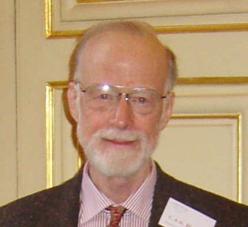

========================================
 Exposición: Algoritmos de ordenamiento
========================================

Algoritmos que se expondrán
    + Quicksort_
    + Heapsort_
    + TODO

Fecha de exposición
    2014-04-30

Introducción
============

- TODO: Qué son.
- TODO: Cuándo se aplica.

Quicksort_
==========

La función de este algoritmo es ordenar una lista de elementos del mismo tipo y
está basado en la técnica "divide y vencerás", de modo que convierte un
problema complicado, en muchos sencillos, pero además es el más rápido conocido
para hacer esta tarea. Está matemáticamente demostrado que no se puede hacer un
algoritmo de ordenación más rápido que Quicksort.

Estrategia
----------

El algoritmo trabaja de la siguiente forma:

* Elegir un elemento de la lista de elementos a ordenar, al que llamaremos pivote.
* Resituar los demás elementos de la lista a cada lado del pivote, de manera que a un lado queden todos los menores que él, y al otro los mayores. Los elementos iguales al pivote pueden ser colocados tanto a su derecha como a su izquierda, dependiendo de la implementación deseada. En este momento, el pivote ocupa exactamente el lugar que le corresponderá en la lista ordenada.
* La lista queda separada en dos sublistas, una formada por los elementos a la izquierda del pivote, y otra por los elementos a su derecha.
* Repetir este proceso de forma recursiva para cada sublista mientras éstas contengan más de un elemento. Una vez terminado este proceso todos los elementos estarán ordenados.

Su autor
--------

   Charles Antony Richard Hoare

Su autor es **Charles Antony Richard Hoare** (Tony Hoare), nacido en Colombo,
Sri Lanka, el 11 de enero de 1934. Es un científico en computación que también
se lo conoce por otros trabajos:

* Desarrollo de la *Lógica de Hoare*.
* Creación del lenguaje formal CSP.

Descubrió el algoritmo Quicksort en 1960 intentando facilitar la búsqueda de
palabras en el diccionario. Actualmente trabaja como investigador senior para
Microsoft en Cambridge.

Complejidad
-----------

En el caso promedio, el orden es O(n·log n).

Escenarios
----------

Como se puede suponer, la eficiencia del algoritmo depende de la posición en la
que termine el pivote elegido.

* En el mejor caso, el pivote termina en el centro de la lista, dividiéndola en dos sublistas de igual tamaño. En este caso, el orden de complejidad del algoritmo es O(n·log n).
* En el peor caso, el pivote termina en un extremo de la lista. El orden de complejidad del algoritmo es entonces de O(n²). El peor caso dependerá de la implementación del algoritmo, aunque habitualmente ocurre en listas que se encuentran ordenadas, o casi ordenadas. Pero principalmente depende del pivote, si por ejemplo el algoritmo implementado toma como pivote siempre el primer elemento del array, y el array que le pasamos está ordenado, siempre va a generar a su izquierda un array vacío, lo que es ineficiente.

Implementación
--------------

- TODO ejemplo de implementación.

Heapsort_
=========

- TODO en qué consiste.
- TODO quién lo creó.
- TODO complejidad.
- TODO mejores escenarios.
- TODO peores escenarios.
- TODO ejemplo de implementación.

Bibliografía
============

* Wikipedia

    + C. A. R. Hoare: http://es.wikipedia.org/wiki/C._A._R._Hoare

