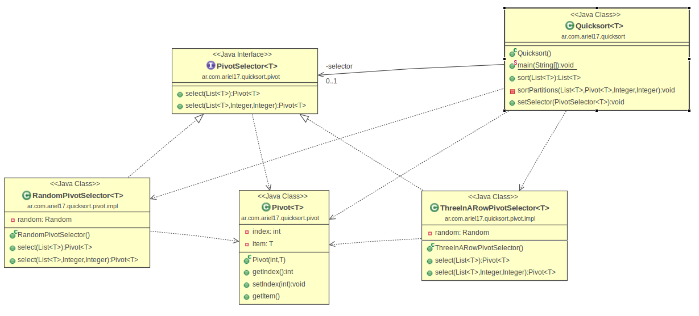

Algoritmos de ordenamiento
---------------------------

.. rst-class:: title-initial
Quicksort

Qué es un algoritmo de ordenamiento
-----------------------------------

Un algoritmo de ordenamiento es conjunto prescrito de reglas ordenadas y
finitas para poner los elementos de un vector o una lista en su correspondiente
lugar dado por una relación de orden.

Acerca de Quicksort
-------------------

.. rst-class:: build

* Ordenar una lista de elementos del mismo tipo.

* *Divide y vencerás*; convierte un problema complicado en muchos sencillos.

* El más rápido conocido para hacer este tipo de tareas.

* Está matemáticamente demostrado que no se puede hacer un algoritmo de
  ordenación más rápido.

Charles Antony Richard Hoare
----------------------------

.. figure:: ../_static/img/CAR_Hoare.jpg
   :width: 40%
   :class: border
   :align: center

* Científico en computación. 
* Descubrió Quicksort en 1960 intentando facilitar la búsqueda de palabras en
  el diccionario.
* Trabaja como investigador senior para Microsoft en Cambridge.

Estrategia
----------

.. rst-class:: build

* Elegir un elemento entre el conjunto a ordenar (**pivote**).

* 3 particiones: 

  + :math:`L1 = \left\{ x / x \in L-\left\{v\right\} \wedge x \leq v \right\}`
  + :math:`L2 = \left\{ v \right\}`
  + :math:`L3 = \left\{ x / x \in L-\left\{v\right\} \wedge x \geq v \right\}`

* Repetir recursivamente.

Algoritmo en acción
-------------------

.. figure:: ../_static/img/Sorting_quicksort_anim.gif
   :width: 90%

Mejor escenario
---------------

.. rst-class:: build

* El pivote está en el centro de la lista (tamaño L1 = tamaño L2).
* El orden de complejidad es :math:`O(n * log(n))`.

  .. figure:: ../_static/img/nlogn.png
     :width: 70%

Peor escenario
--------------

.. rst-class:: build

* El pivote está en un extremo (generalemente listas ordenadas/semiordenadas).

* El orden de complejidad es :math:`O(n^2)`.

  .. figure:: ../_static/img/n2.png
     :width: 70%

Eligiendo el Pivote
-------------------

La eficiencia depende de la posición del pivote seleccionado.

.. rst-class:: build

* **Azar**: estrategia por defecto.
  
  + Pro: sin cálculos adicionales; rápido.
  + Con: aparecerá el peor escenario (pivote en extremo).

* **Determinar de antemano el pivote**:

  + Pro: se hace en :math:`O(n)` y asegura complejidad :math:`O(n * log(n))`.
  + Con: el cálculo adicional rebaja la eficiencia.

* **A 3 bandas**: mayor adopción. Valor medio de tres elementos o el promedio.

Moviendo elementos
------------------

.. rst-class:: build

* Sean ``i`` índice izquierdo, ``j`` índice derecho, ``L`` lista de elementos,
  ``v`` pivote.
* Recorrer la lista simultáneamente con ``i`` y ``j``
* Cuando ``L[i] > v`` y ``L[j] < v`` se intercambian los elementos.
* Repetir hasta que se crucen los índices.
* El punto de encuentro es la posición adecuada para colocar ``v``.

Ejemplo de implementación
-------------------------

Bibliografía
------------

+ *Algoritmo de ordenamiento*: http://es.wikipedia.org/wiki/Algoritmo_de_ordenamiento
+ *C. A. R. Hoare*: http://es.wikipedia.org/wiki/C._A._R._Hoare
+ *Quicksort*: http://es.wikipedia.org/wiki/Quicksort
+ *Quicksort - Técnicas de elección del pivote*:
  http://es.wikipedia.org/wiki/Quicksort#T.C3.A9cnicas_de_elecci.C3.B3n_del_pivote 
+ *Implementando el algoritmo Quicksort*:
  http://www.genbetadev.com/algoritmos/implementando-el-algoritmo-quicksort 

.. slide::
   :level: 2

   .. figure:: ../_static/img/one_does_not_simply.jpg
      :width: 100 %
      :align: center
      :class: title-finale

