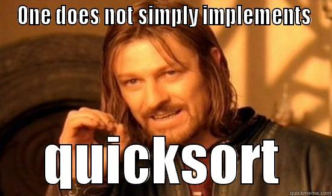

Algoritmos de ordenamiento
---------------------------

Quicksort

Qué es un algoritmo de ordenamiento
-----------------------------------

Un algoritmo de ordenamiento es conjunto prescrito de reglas ordenadas y
finitas para poner los elementos de un vector o una lista en su correspondiente
lugar dado por una relación de orden.

Quicksort
---------

.. rst-class:: build

* Ordenar una lista de elementos del mismo tipo.

* Está basado en la técnica *divide y vencerás*; convierte un problema
  complicado en muchos sencillos.

* Es el más rápido conocido para hacer este tipo de tareas.

* Está matemáticamente demostrado que no se puede hacer un algoritmo de
  ordenación más rápido que Quicksort.

Charles Antony Richard Hoare
----------------------------

.. figure:: ../_static/img/CAR_Hoare.jpg

* Científico en computación. 
* Descubrió Quicksort en 1960 intentando facilitar la búsqueda de palabras en
  el diccionario.
* También conocido por:

  + Desarrollar de la *Lógica de Hoare*.
  + Creación del lenguaje formal CSP.

* Trabaja como investigador senior para Microsoft en Cambridge.

Estrategia
----------

.. rst-class:: build

* Elegir un elemento entre los elementos a ordenar (**pivote**).

* 3 particiones: 

  + :math:`L1 = \left\{ x / x \in L-\left\{v\right\} \wedge x \leq v \right\}`
  + :math:`L2 = \left\{ v \right\}`
  + :math:`L3 = \left\{ x / x \in L-\left\{v\right\} \wedge x \geq v \right\}`

* Repetir recursivamente.

Algoritmo en acción
-------------------

.. figure:: ../_static/img/Sorting_quicksort_anim.gif

Mejor escenario
---------------

.. rst-class:: build

* El pivote está en el centro de la lista (tamaño L1 = tamaño L2).
* El orden de complejidad es :math:`O(n * log(n))`.

  .. figure:: ../_static/img/nlogn.png

Peor escenario
--------------

.. rst-class:: build

* El pivote está en un extremo de la lista (generalemente listas
  ordenadas/semiordenadas).

* El orden de complejidad es :math:`O(n^2)`.

  .. figure:: ../_static/img/n2.png

Eligiendo el Pivote
-------------------

La eficiencia del algoritmo depende de la posición en la que termine el pivote
elegido.

.. rst-class:: build

* **Azar**: estrategia por defecto.
  
  + Pro: sin cálculos adicionales; rápido.
  + Con: aparecerá el peor escenario (pivote en extremo).

* **Determinar de antemano el pivote**:

  + Pro: se hace en :math:`O(n)` y asegura complejidad :math:`O(n * log(n))` en
    el peor caso

  + Con: el cálculo adicional rebaja la eficiencia en el caso promedio.

* **A 3 bandas**: se toma tres elementos de la lista y se elige el valor medio
  o promedio.

Moviendo elementos
------------------

Para reposicionar los elementos una vez seleccionado el pivote se utilizan dos
índices: sean ``i`` como índice izquierdo, ``j`` como índice derecho y
``L`` una lista de elementos a ordenarse:

* Recorrer la lista simultáneamente con ``i`` y ``j``: por la izquierda con
  ``i`` (desde el primer elemento), y por la derecha con j (desde el último
  elemento).
* Cuando ``L[i]`` sea mayor que el pivote y ``L[j]`` sea menor, se intercambian
  los elementos en esas posiciones.
* Repetir esto hasta que se crucen los índices.
* El punto en que se cruzan los índices es la posición adecuada para colocar el
  pivote, porque sabemos que a un lado los elementos son todos menores y al
  otro son todos mayores (o habrían sido intercambiados).

Ejemplo de implementación
-------------------------

.. figure:: ../_src/quicksort/doc/class_diagram.png

Having fun with Quicksort (?)
-----------------------------

Bibliografía
------------

+ Algoritmo de ordenamiento: http://es.wikipedia.org/wiki/Algoritmo_de_ordenamiento
+ C. A. R. Hoare: http://es.wikipedia.org/wiki/C._A._R._Hoare
+ Quicksort: http://es.wikipedia.org/wiki/Quicksort
+ Quicksort - Técnicas de elección del pivote:
  http://es.wikipedia.org/wiki/Quicksort#T.C3.A9cnicas_de_elecci.C3.B3n_del_pivote 
+ Implementando el algoritmo Quicksort: http://www.genbetadev.com/algoritmos/implementando-el-algoritmo-quicksort 
